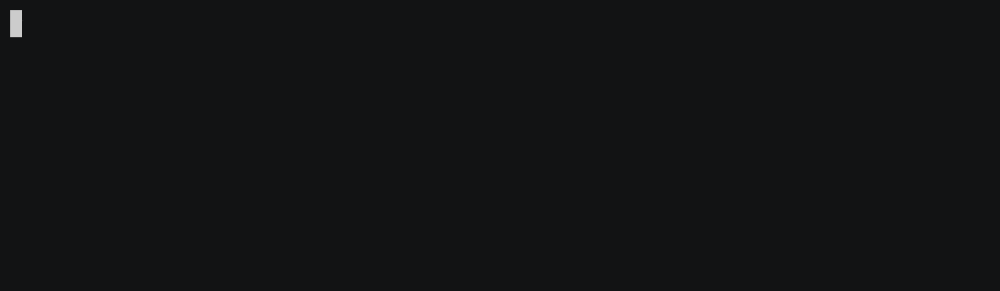

# ANSI Terminal Escape Sequences

Some examples of using ANSI terminal escape sequences in Bash scripts.

## What are terminal escape sequences?

Terminal escape sequences come from the time when people used so-called terminals to connect to remote computers. A terminal is basically just a device where you can enter text and that can display text to you. Text that you enter is sent to the remote computer for interpretation by a program that runs on this computer (for example, a shell or some other program). The output of the program running on the remote computer is sent to the terminal and displayed to you.

In principal, every character that you enter to the terminal is meant to be sent as input to the program running on the remote computer. Similarly, every character that is output by the program running on the remote computer is meant to be displayed on the terminal to you. However, to allow more flexibility, terminals introduced so-called **escape sequences**. These are certain combinations of characters that allow to control the terminal. When a user enters escape sequences, they cause an action on the terminal and are not sent to the program on the remote computer. Similarly, when a program on the remote computer outputs escape sequences, they cause an action to be performed on the terminal and are not displayed to the user.

Some important actions that escape sequences allow to perform on the terminal is moving the cursor on the terminal, deleting text on the terminal, and setting display attributes for the text on the terminal. Display attributes include formattings like bold, italic, underlined, blinking, as well as colours, such as the foreground and background colour of the text.

Escape sequences can be interwoven with the ordinary input and output characters. The terminal detects the escape sequences, performs their associated actions, and then displays the remaining characters to the user or sends them to the program on the remote computer, respectively.

## What are ANSI escape sequences?

ANSI escape sequences is the common name for the most widely used set of terminal escape sequences of today. They have been part of various historical standards. Originally, they go back to the **ECMA-48 standard** of the [European Computer Manufacturers Association (ECMA)](https://www.ecma-international.org/) from 1976. The [American National Standards Institute (ANSI)](https://www.ansi.org/) adopted this standard nearly unchanged as **ANSI X3.64** in 1977. The [International Organization for Standardization (ISO)](https://www.iso.org/home.html) adopted the same standard as **ISO 6429** in 1978. For the coming years, all three standards existed side by side with only little differences. Finally, in 1981, all three standards were merged to the **ISO/IEC 6429** standard that is valid until today. The older standards where discontinued in favour of the new harmonised one. This history of standards is illustrated in the following figure.

Even though the escape sequences do not go back solely to ANSI, and the ANSI standard was even disontinued, the escape sequences are referred to as ANSI escape sequences until today.

The first terminal to adopt these escape sequences was the [VT100](https://vt100.net/) from [Digital Equipment Corporation [DEC](https://en.wikipedia.org/wiki/Digital_Equipment_Corporation)) in 1979. This terminal was extremely popular and many other vendors adopted its set of escape sequences. That's why until today, the ANSI escape sequences are also sometimes referred to as **VT100 escape sequences**.

Unfortunately, the standard documents (except for ECMA-48) are not freely accessible. This is the closest you can get to them:

- **ECMA-48:** https://www.ecma-international.org/publications/standards/Ecma-048.htm
- **ANSI X3.64:** https://standards.globalspec.com/std/512717/ansi-x3-64
- **ISO/EIC 6429:** https://www.iso.org/standard/12782.html

## What can you do with ANSI terminal sequences?

## Examples

### Spinning Wheel

### Progress Bar

